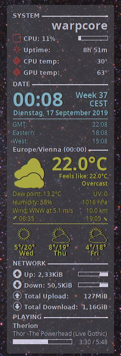

# My conky setup

This is my personal conky configuration  It is largely based on the work of others, particularly [this 
remake](https://github.com/rsheasby/Conky-Lililo-2018) of a fairly popular conky setup. I changed 
quite a few things though.

The PHP script is gone and replaced with an compiled D version. The executable `darksky-d` (available 
from the releases page) should run on any modern 64bit Linux as there are no dependencies other than 
standard libraries. If it does not, you will have to build it yourself from source. 

Use `darksky-d --help` to see the options. Make sure, you specify at least the API key. By default, 
darksky-d outputs to stdout so redirect to >weather. Also by default, it uses metric (si) units, but 
there are options to output imperial units. 

## How does it look?

Note the shot shows the version I use, it's compact, some lines are missing but you can easily add 
memory and swap information by un-commenting them in `conkyrc`. Same is true for "per CPU" load 
values.



## Default directory

Everything is supposed to live in `$HOME/.weather`. You can change this, but then you have to edit 
conkyrc and change the line `template0 = "$HOME/.weather/weather"`accordingly. The file `weather` must 
be available for conky to pick up the data. To generate this file run **darksky-d** periodically via a 
cronjob. Conky itself does NOT fetch anything from the net, it just reads `$HOME/.weather/weather` and 
displays no weather when this file is missing or not readable.
 
Make sure, `darksky-d` has write access to `$HOME/.weather` (or the directory you put it into)

## Location for weather data

You must tell `darksky-d` the latitude and longitude of your current position. Use the `--loc` 
parameter for this and `--help` will give you an example. Obtaining the location from geoclue2 is 
currently a TODO item. This is saved in the configuration file in `$HOME/.config 
/darksky-d/config.json` until a different location is given. 

## So what's in?

* Generic system overview (CPU, RAM, swap, uptime, temperatures) * Time and date, including week 
number and local timezone * 3 lines of world time. You can easily change the zones you want to 
display, check the relevant section in conkyrc around line 100. * A fairly comprehensive weather 
report, including dew point, pressure, wind, visibility, a three day forecast and sunrise/sunset 
times. You need a darksky API key to fetch the data. Darksky is free for 1000 requests per month, 
which should be enough if you update the weather every 30 minutes.
* A program written in D to fetch data and do some conversions when asked to do so. By
  default, it always fetches in si units (Celsius, m/s, km and so on), but you can
  instruct it to convert into imperial units. Run `darksky-d --help` to see usage
  information.
*
## Requirements

* A D Compiler to compile the darksky client. I recommend DMD or LDC, but both are ok.
* A darksky account and an API key. Free, but you have only 1000 API requests per month in freebie 
mode, which should be sufficient for hourly weather updates.

### Conky

Obviously, you need that and you need a recent version (1.10 or later) with lua and cairo support. On 
Ubuntu-based distros, this is just a matter of installing `conky-all`and you should be all set.

### Fonts

* The [OpenLogos Font](https://www.dafont.com/openlogos.font) (only used for the Kernel version line)
* The [Style Bats Font](https://www.dafont.com/style-bats.font) (the icons for CPU load, temperatures, swap, memory...)
* The [Conkyweather Font](https://github.com/altinukshini/conky_blue/blob/master/fonts/conkyweather.ttf) 
* The [Weather Icons Font](https://aur.archlinux.org/packages/ttf-weather-icons/)

## Customization

There are quite a few things to change, 

* In the system section you may want to comment out the individual CPU load graphs. Since I do not 
care about these, I prefer to have only one load bar.

* Also, I have commented out the Kernel version, I usually know which kernel I'm running :)

### GPU temperature

You'll find this around line 90 in the `conkyrc`:

```
${voffset 5}${font Weather Icons:size=12}${color cc5050}  ${color}${font} ${voffset -3}GPU temp: ${alignr}${nvidia temp}°
```
This only works with the proprietary nvidia drivers. If you use nouveau, you'll have to change the 
last part to something like `${hwmon 1 temp 1}` to get the GPU temperature.
